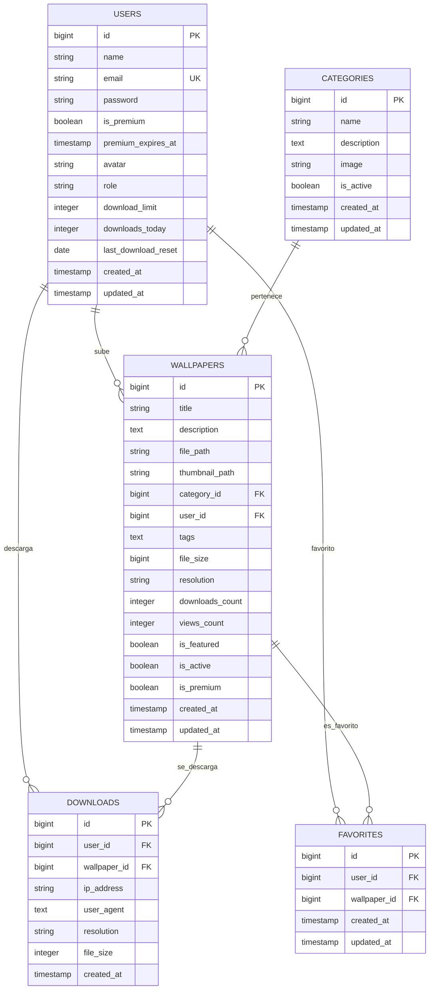

# 🗄️ Base de Datos - Vision4K

## 🎯 Recomendación: PostgreSQL

### ¿Por qué PostgreSQL sobre MySQL?

| Característica        | PostgreSQL                          | MySQL                 |
| --------------------- | ----------------------------------- | --------------------- |
| **JSON/JSONB**        | ✅ Nativo y optimizado              | ⚠️ Básico desde 5.7   |
| **Full-text Search**  | ✅ Avanzado y configurable          | ⚠️ Limitado           |
| **Índices Avanzados** | ✅ GIN, GiST, BRIN, Hash            | ❌ Solo B-tree, Hash  |
| **Arrays**            | ✅ Soporte nativo                   | ❌ No soporta         |
| **Extensiones**       | ✅ PostGIS, pg_trgm, etc.           | ⚠️ Pocas opciones     |
| **Compliance SQL**    | ✅ Estricto ANSI SQL                | ⚠️ Más permisivo      |
| **Escalabilidad**     | ✅ Excelente para lectura/escritura | ⚠️ Mejor para lectura |
| **Transacciones**     | ✅ ACID completo                    | ⚠️ Depende del engine |

**Para Vision4K es ideal porque**:

- Manejo eficiente de tags como arrays
- Búsquedas de texto completo en títulos/descripciones
- Metadatos de imágenes en JSONB
- Mejor escalabilidad para miles de wallpapers

## 📊 Diagrama de Relaciones



## 🗂️ Estructura Detallada de Tablas

### 👤 Tabla: `users`

```sql
CREATE TABLE users (
    id                  BIGSERIAL PRIMARY KEY,
    name                VARCHAR(255) NOT NULL,
    email               VARCHAR(255) UNIQUE NOT NULL,
    email_verified_at   TIMESTAMP NULL,
    password            VARCHAR(255) NOT NULL,
    remember_token      VARCHAR(100) NULL,

    -- Campos Premium
    is_premium          BOOLEAN DEFAULT FALSE,
    premium_expires_at  TIMESTAMP NULL,
    avatar              VARCHAR(255) NULL,
    role                VARCHAR(50) DEFAULT 'user', -- user, admin, moderator

    -- Control de Descargas
    download_limit      INTEGER DEFAULT 10,
    downloads_today     INTEGER DEFAULT 0,
    last_download_reset DATE NULL,

    created_at          TIMESTAMP DEFAULT NOW(),
    updated_at          TIMESTAMP DEFAULT NOW()
);

-- Índices
CREATE INDEX idx_users_premium ON users(is_premium, premium_expires_at);
CREATE INDEX idx_users_role ON users(role);
CREATE INDEX idx_users_download_reset ON users(last_download_reset);
```

**Campos Explicados**:

- `is_premium`: Estado premium actual
- `premium_expires_at`: NULL = premium permanente
- `role`: Roles del sistema (user/admin/moderator)
- `download_limit`: Límite diario para usuarios gratuitos
- `downloads_today`: Contador que se resetea diariamente
- `last_download_reset`: Para reseteo automático

### 📁 Tabla: `categories`

```sql
CREATE TABLE categories (
    id          BIGSERIAL PRIMARY KEY,
    name        VARCHAR(255) NOT NULL,
    description TEXT,
    image       VARCHAR(255), -- Imagen representativa
    is_active   BOOLEAN DEFAULT TRUE,
    created_at  TIMESTAMP DEFAULT NOW(),
    updated_at  TIMESTAMP DEFAULT NOW()
);

-- Índices
CREATE INDEX idx_categories_active ON categories(is_active);
CREATE INDEX idx_categories_name ON categories(name);
```

**Características**:

- Cada categoría tiene una imagen destacada
- Sistema de activación/desactivación
- Descripción opcional para SEO

### 🖼️ Tabla: `wallpapers`

```sql
CREATE TABLE wallpapers (
    id              BIGSERIAL PRIMARY KEY,
    title           VARCHAR(255) NOT NULL,
    description     TEXT,
    file_path       VARCHAR(255) NOT NULL, -- storage/wallpapers/filename.jpg
    thumbnail_path  VARCHAR(255),          -- storage/thumbnails/filename.jpg

    -- Relaciones
    category_id     BIGINT REFERENCES categories(id) ON DELETE CASCADE,
    user_id         BIGINT REFERENCES users(id) ON DELETE CASCADE,

    -- Metadatos
    tags            TEXT, -- "nature,landscape,mountains" (separados por comas)
    file_size       BIGINT, -- Tamaño en bytes
    resolution      VARCHAR(50), -- "3840x2160", "1920x1080"

    -- Estadísticas
    downloads_count INTEGER DEFAULT 0,
    views_count     INTEGER DEFAULT 0,

    -- Estados
    is_featured     BOOLEAN DEFAULT FALSE,
    is_active       BOOLEAN DEFAULT TRUE,
    is_premium      BOOLEAN DEFAULT FALSE,

    created_at      TIMESTAMP DEFAULT NOW(),
    updated_at      TIMESTAMP DEFAULT NOW()
);

-- Índices de Performance
CREATE INDEX idx_wallpapers_active_featured ON wallpapers(is_active, is_featured);
CREATE INDEX idx_wallpapers_category_active ON wallpapers(category_id, is_active);
CREATE INDEX idx_wallpapers_downloads ON wallpapers(downloads_count DESC);
CREATE INDEX idx_wallpapers_views ON wallpapers(views_count DESC);
CREATE INDEX idx_wallpapers_premium_active ON wallpapers(is_premium, is_active);
CREATE INDEX idx_wallpapers_created ON wallpapers(created_at DESC);
CREATE INDEX idx_wallpapers_user ON wallpapers(user_id);

-- Índice de texto completo para búsquedas
CREATE INDEX idx_wallpapers_search ON wallpapers USING gin(to_tsvector('spanish', title || ' ' || description || ' ' || tags));
```

**Campos Especiales**:

- `tags`: Separados por comas para búsquedas
- `is_premium`: Contenido exclusivo para premium
- `file_path`: Ruta relativa desde storage
- `thumbnail_path`: Miniatura generada automáticamente

### 📥 Tabla: `downloads`

```sql
CREATE TABLE downloads (
    id           BIGSERIAL PRIMARY KEY,
    user_id      BIGINT REFERENCES users(id) ON DELETE CASCADE NULL, -- NULL para anónimos
    wallpaper_id BIGINT REFERENCES wallpapers(id) ON DELETE CASCADE,

    -- Tracking
    ip_address   INET NOT NULL, -- Soporte IPv4/IPv6
    user_agent   TEXT,
    resolution   VARCHAR(50), -- Resolución descargada
    file_size    INTEGER,     -- Tamaño del archivo descargado

    created_at   TIMESTAMP DEFAULT NOW()
);

-- Índices para Analytics
CREATE INDEX idx_downloads_user_date ON downloads(user_id, created_at);
CREATE INDEX idx_downloads_wallpaper_date ON downloads(wallpaper_id, created_at);
CREATE INDEX idx_downloads_ip_date ON downloads(ip_address, created_at);
CREATE INDEX idx_downloads_date ON downloads(created_at);

-- Índice para limitar descargas por IP
CREATE INDEX idx_downloads_ip_today ON downloads(ip_address, DATE(created_at));
```

**Propósito**:

- Analytics de descargas
- Control de límites por usuario/IP
- Estadísticas de popularidad
- Tracking de resoluciones más descargadas

### ⭐ Tabla: `favorites`

```sql
CREATE TABLE favorites (
    id           BIGSERIAL PRIMARY KEY,
    user_id      BIGINT REFERENCES users(id) ON DELETE CASCADE,
    wallpaper_id BIGINT REFERENCES wallpapers(id) ON DELETE CASCADE,
    created_at   TIMESTAMP DEFAULT NOW(),
    updated_at   TIMESTAMP DEFAULT NOW(),

    -- Prevenir duplicados
    UNIQUE(user_id, wallpaper_id)
);

-- Índices
CREATE INDEX idx_favorites_user_date ON favorites(user_id, created_at DESC);
CREATE INDEX idx_favorites_wallpaper ON favorites(wallpaper_id);
```

**Características**:

- Relación many-to-many entre users y wallpapers
- Constraint único para evitar duplicados
- Timestamps para ordenar favoritos por fecha

## 🚀 Migraciones

### Orden de Ejecución

1. `create_users_table` (ya existe en Laravel)
2. `create_categories_table`
3. `create_wallpapers_table`
4. `add_premium_fields_to_users_table`
5. `create_downloads_table`
6. `create_favorites_table`

### Migración de Ejemplo

```php
// 2024_01_16_000002_create_wallpapers_table.php
public function up(): void
{
    Schema::create('wallpapers', function (Blueprint $table) {
        $table->id();
        $table->string('title');
        $table->text('description')->nullable();
        $table->string('file_path');
        $table->string('thumbnail_path')->nullable();
        $table->foreignId('category_id')->constrained()->cascadeOnDelete();
        $table->text('tags')->nullable();
        $table->bigInteger('file_size')->nullable();
        $table->string('resolution')->nullable();
        $table->integer('downloads_count')->default(0);
        $table->integer('views_count')->default(0);
        $table->boolean('is_featured')->default(false);
        $table->boolean('is_active')->default(true);
        $table->boolean('is_premium')->default(false);
        $table->foreignId('user_id')->constrained()->cascadeOnDelete();
        $table->timestamps();

        // Índices
        $table->index(['is_active', 'is_featured']);
        $table->index(['category_id', 'is_active']);
        $table->index('downloads_count');
        $table->index(['is_premium', 'is_active']);
    });
}
```

## 📊 Queries Optimizadas

### Trending Wallpapers

```sql
-- Wallpapers más populares de la última semana
SELECT w.*, c.name as category_name
FROM wallpapers w
JOIN categories c ON w.category_id = c.id
WHERE w.is_active = true
  AND w.created_at >= NOW() - INTERVAL '7 days'
ORDER BY (w.downloads_count + w.views_count) DESC
LIMIT 20;
```

### Búsqueda de Texto Completo

```sql
-- Búsqueda en título, descripción y tags
SELECT w.*, ts_rank(to_tsvector('spanish', w.title || ' ' || w.description || ' ' || w.tags), plainto_tsquery('spanish', 'naturaleza montaña')) as rank
FROM wallpapers w
WHERE w.is_active = true
  AND to_tsvector('spanish', w.title || ' ' || w.description || ' ' || w.tags) @@ plainto_tsquery('spanish', 'naturaleza montaña')
ORDER BY rank DESC, w.downloads_count DESC;
```

### Analytics de Descargas

```sql
-- Descargas por día de los últimos 30 días
SELECT DATE(created_at) as date, COUNT(*) as downloads
FROM downloads
WHERE created_at >= NOW() - INTERVAL '30 days'
GROUP BY DATE(created_at)
ORDER BY date;
```

## 🔧 Mantenimiento

### Limpieza Automática

```sql
-- Limpiar descargas de más de 1 año
DELETE FROM downloads WHERE created_at < NOW() - INTERVAL '1 year';

-- Resetear contadores diarios
UPDATE users SET downloads_today = 0 WHERE last_download_reset < CURRENT_DATE;
```

### Optimización de Índices

```sql
-- Análisis de uso de índices
SELECT schemaname, tablename, indexname, idx_scan, idx_tup_read, idx_tup_fetch
FROM pg_stat_user_indexes
ORDER BY idx_scan DESC;

-- Reindexar tablas grandes
REINDEX TABLE wallpapers;
```

### Backup y Restore

```bash
# Backup completo
pg_dump -U username -h localhost vision4k > backup.sql

# Backup solo datos
pg_dump -U username -h localhost --data-only vision4k > data_backup.sql

# Restore
psql -U username -h localhost vision4k < backup.sql
```

---

Esta estructura de base de datos está optimizada para el rendimiento, escalabilidad y facilidad de mantenimiento de Vision4K.
