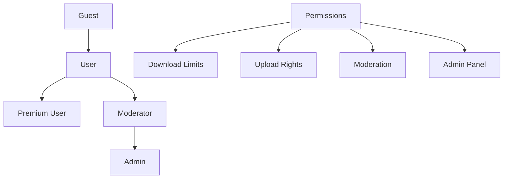

# 👥 Sistema de Usuarios - Vision4K

## 🏗️ Arquitectura del Sistema

### 🎭 Roles y Permisos



## 👤 Modelo de Usuario

### 📝 Estructura del Modelo

```php
<?php
// app/Models/User.php

class User extends Authenticatable
{
    // Roles del sistema
    const ROLE_USER = 'user';
    const ROLE_MODERATOR = 'moderator';
    const ROLE_ADMIN = 'admin';

    // Estados premium
    const PREMIUM_ACTIVE = 'active';
    const PREMIUM_EXPIRED = 'expired';
    const PREMIUM_TRIAL = 'trial';

    protected $fillable = [
        'name', 'email', 'password', 'avatar',
        'is_premium', 'premium_expires_at', 'role',
        'download_limit', 'downloads_today', 'last_download_reset'
    ];

    protected $casts = [
        'is_premium' => 'boolean',
        'premium_expires_at' => 'datetime',
        'last_download_reset' => 'date',
        'email_verified_at' => 'datetime',
    ];
}
```

### 🔗 Relaciones del Usuario

```php
// Wallpapers subidos por el usuario
public function wallpapers(): HasMany
{
    return $this->hasMany(Wallpaper::class);
}

// Descargas realizadas
public function downloads(): HasMany
{
    return $this->hasMany(Download::class);
}

// Wallpapers favoritos
public function favorites(): BelongsToMany
{
    return $this->belongsToMany(Wallpaper::class, 'favorites')
                ->withTimestamps();
}

// Estadísticas de uploads
public function uploadsCount(): int
{
    return $this->wallpapers()->where('is_active', true)->count();
}

// Estadísticas de descargas
public function totalDownloads(): int
{
    return $this->downloads()->count();
}
```

## 🚀 Funcionalidades de Usuario

### 🔐 Autenticación

#### Registro de Usuario

```php
// app/Http/Controllers/Auth/RegisterController.php

public function create(Request $request)
{
    $request->validate([
        'name' => 'required|string|max:255',
        'email' => 'required|string|email|max:255|unique:users',
        'password' => 'required|string|min:8|confirmed',
    ]);

    $user = User::create([
        'name' => $request->name,
        'email' => $request->email,
        'password' => Hash::make($request->password),
        'role' => User::ROLE_USER,
        'download_limit' => 10, // Límite por defecto
        'downloads_today' => 0,
        'last_download_reset' => now()->toDateString(),
    ]);

    // Enviar email de verificación
    $user->sendEmailVerificationNotification();

    // Crear trial premium por 7 días
    $this->createTrialPremium($user);

    return response()->json([
        'user' => $user,
        'token' => $user->createToken('auth-token')->plainTextToken
    ]);
}

private function createTrialPremium(User $user): void
{
    $user->update([
        'is_premium' => true,
        'premium_expires_at' => now()->addDays(7),
    ]);
}
```

#### Login con Rate Limiting

```php
// app/Http/Controllers/Auth/LoginController.php

public function login(Request $request)
{
    // Rate limiting por IP
    $key = 'login_attempts:' . $request->ip();
    $maxAttempts = 5;
    $decayMinutes = 15;

    if (RateLimiter::tooManyAttempts($key, $maxAttempts)) {
        return response()->json([
            'error' => 'Too many login attempts. Try again in ' .
                      RateLimiter::availableIn($key) . ' seconds.'
        ], 429);
    }

    $credentials = $request->validate([
        'email' => 'required|email',
        'password' => 'required',
    ]);

    if (Auth::attempt($credentials, $request->remember)) {
        RateLimiter::clear($key);

        $user = Auth::user();

        // Verificar si el premium expiró
        $this->checkPremiumStatus($user);

        return response()->json([
            'user' => $user,
            'token' => $user->createToken('auth-token')->plainTextToken
        ]);
    }

    RateLimiter::hit($key, $decayMinutes * 60);

    return response()->json([
        'error' => 'Invalid credentials'
    ], 401);
}
```

### 💎 Sistema Premium

#### Verificación de Estado Premium

```php
// app/Models/User.php

public function isPremiumActive(): bool
{
    if (!$this->is_premium) {
        return false;
    }

    // Si premium_expires_at es null, es premium permanente
    if (is_null($this->premium_expires_at)) {
        return true;
    }

    return $this->premium_expires_at->isFuture();
}

public function getPremiumStatus(): string
{
    if (!$this->is_premium) {
        return 'free';
    }

    if (is_null($this->premium_expires_at)) {
        return 'lifetime';
    }

    if ($this->premium_expires_at->isFuture()) {
        $daysLeft = now()->diffInDays($this->premium_expires_at);
        if ($daysLeft <= 7) {
            return 'expiring_soon';
        }
        return 'active';
    }

    return 'expired';
}

public function premiumDaysLeft(): ?int
{
    if (!$this->isPremiumActive() || is_null($this->premium_expires_at)) {
        return null;
    }

    return max(0, now()->diffInDays($this->premium_expires_at));
}
```

#### Middleware Premium

```php
// app/Http/Middleware/RequirePremium.php

class RequirePremium
{
    public function handle(Request $request, Closure $next)
    {
        $user = $request->user();

        if (!$user) {
            return response()->json(['error' => 'Authentication required'], 401);
        }

        if (!$user->isPremiumActive()) {
            return response()->json([
                'error' => 'Premium subscription required',
                'upgrade_url' => route('premium.plans'),
                'status' => $user->getPremiumStatus()
            ], 403);
        }

        return $next($request);
    }
}
```

### 📥 Sistema de Descargas

#### Control de Límites

```php
// app/Models/User.php

public function canDownload(): bool
{
    // Premium users sin límites
    if ($this->isPremiumActive()) {
        return true;
    }

    // Resetear contador si es un nuevo día
    $this->resetDailyDownloadsIfNeeded();

    return $this->downloads_today < $this->download_limit;
}

public function getRemainingDownloads(): int
{
    if ($this->isPremiumActive()) {
        return -1; // Ilimitado
    }

    $this->resetDailyDownloadsIfNeeded();

    return max(0, $this->download_limit - $this->downloads_today);
}

public function resetDailyDownloadsIfNeeded(): void
{
    if ($this->last_download_reset < now()->toDateString()) {
        $this->update([
            'downloads_today' => 0,
            'last_download_reset' => now()->toDateString(),
        ]);
    }
}

public function incrementDownloadCount(): void
{
    $this->resetDailyDownloadsIfNeeded();

    if (!$this->isPremiumActive()) {
        $this->increment('downloads_today');
    }
}
```

#### Registro de Descarga

```php
// app/Services/DownloadService.php

class DownloadService
{
    public function recordDownload(User $user, Wallpaper $wallpaper, Request $request): Download
    {
        // Verificar permisos
        if (!$user->canDownload()) {
            throw new \Exception('Download limit exceeded');
        }

        // Verificar si es premium only
        if ($wallpaper->is_premium && !$user->isPremiumActive()) {
            throw new \Exception('Premium content requires subscription');
        }

        // Crear registro de descarga
        $download = Download::create([
            'user_id' => $user->id,
            'wallpaper_id' => $wallpaper->id,
            'ip_address' => $request->ip(),
            'user_agent' => $request->userAgent(),
            'resolution' => $request->input('resolution', $wallpaper->resolution),
            'file_size' => $wallpaper->file_size,
        ]);

        // Incrementar contadores
        $user->incrementDownloadCount();
        $wallpaper->increment('downloads_count');

        return $download;
    }
}
```

### ⭐ Sistema de Favoritos

#### Gestión de Favoritos

```php
// app/Http/Controllers/FavoriteController.php

class FavoriteController extends Controller
{
    public function toggle(Request $request, Wallpaper $wallpaper)
    {
        $user = $request->user();

        $favorite = $user->favorites()->where('wallpaper_id', $wallpaper->id)->first();

        if ($favorite) {
            // Remover de favoritos
            $user->favorites()->detach($wallpaper->id);
            $action = 'removed';
        } else {
            // Añadir a favoritos
            $user->favorites()->attach($wallpaper->id);
            $action = 'added';
        }

        return response()->json([
            'action' => $action,
            'is_favorite' => $action === 'added',
            'favorites_count' => $user->favorites()->count()
        ]);
    }

    public function index(Request $request)
    {
        $user = $request->user();

        $favorites = $user->favorites()
            ->with(['category', 'user'])
            ->where('is_active', true)
            ->orderBy('favorites.created_at', 'desc')
            ->paginate(20);

        return Inertia::render('Favorites/Index', [
            'favorites' => $favorites
        ]);
    }
}
```

## 🛡️ Sistema de Roles y Permiisones

### 🔑 Definición de Permisos

```php
// app/Models/User.php

public function hasRole(string $role): bool
{
    return $this->role === $role;
}

public function isAdmin(): bool
{
    return $this->hasRole(self::ROLE_ADMIN);
}

public function isModerator(): bool
{
    return $this->hasRole(self::ROLE_MODERATOR) || $this->isAdmin();
}

public function canUploadWallpapers(): bool
{
    return $this->email_verified_at !== null;
}

public function canModerateContent(): bool
{
    return $this->isModerator();
}

public function canAccessAdminPanel(): bool
{
    return $this->isAdmin();
}

public function canDeleteWallpaper(Wallpaper $wallpaper): bool
{
    return $this->isAdmin() ||
           ($this->isModerator() && !$wallpaper->user->isAdmin()) ||
           $wallpaper->user_id === $this->id;
}
```

### 🚧 Middleware de Roles

```php
// app/Http/Middleware/RequireRole.php

class RequireRole
{
    public function handle(Request $request, Closure $next, string $role)
    {
        $user = $request->user();

        if (!$user) {
            return redirect()->route('login');
        }

        if (!$user->hasRole($role) && !$user->isAdmin()) {
            abort(403, 'Insufficient permissions');
        }

        return $next($request);
    }
}
```

## 📊 Perfil de Usuario

### 🏠 Dashboard Personal

```php
// app/Http/Controllers/UserDashboardController.php

class UserDashboardController extends Controller
{
    public function index(Request $request)
    {
        $user = $request->user();

        // Estadísticas del usuario
        $stats = [
            'uploads_count' => $user->wallpapers()->where('is_active', true)->count(),
            'total_downloads' => $user->wallpapers()->sum('downloads_count'),
            'favorites_count' => $user->favorites()->count(),
            'downloads_today' => $user->downloads_today,
            'remaining_downloads' => $user->getRemainingDownloads(),
            'premium_status' => $user->getPremiumStatus(),
            'premium_days_left' => $user->premiumDaysLeft(),
        ];

        // Wallpapers recientes del usuario
        $recentUploads = $user->wallpapers()
            ->with('category')
            ->latest()
            ->take(6)
            ->get();

        // Favoritos recientes
        $recentFavorites = $user->favorites()
            ->with(['category', 'user'])
            ->latest('favorites.created_at')
            ->take(6)
            ->get();

        // Actividad reciente
        $recentActivity = $this->getRecentActivity($user);

        return Inertia::render('Dashboard/Index', [
            'stats' => $stats,
            'recentUploads' => $recentUploads,
            'recentFavorites' => $recentFavorites,
            'recentActivity' => $recentActivity,
        ]);
    }

    private function getRecentActivity(User $user): Collection
    {
        $activities = collect();

        // Uploads recientes
        $user->wallpapers()->latest()->take(5)->get()->each(function ($wallpaper) use ($activities) {
            $activities->push([
                'type' => 'upload',
                'data' => $wallpaper,
                'created_at' => $wallpaper->created_at,
            ]);
        });

        // Favoritos recientes
        $user->favorites()->latest('favorites.created_at')->take(5)->get()->each(function ($wallpaper) use ($activities) {
            $activities->push([
                'type' => 'favorite',
                'data' => $wallpaper,
                'created_at' => $wallpaper->pivot->created_at,
            ]);
        });

        return $activities->sortByDesc('created_at')->take(10)->values();
    }
}
```

### 📝 Edición de Perfil

```php
// app/Http/Controllers/ProfileController.php

class ProfileController extends Controller
{
    public function update(Request $request)
    {
        $user = $request->user();

        $request->validate([
            'name' => 'required|string|max:255',
            'email' => 'required|string|email|max:255|unique:users,email,' . $user->id,
            'avatar' => 'nullable|image|mimes:jpeg,png,jpg,gif|max:2048',
            'bio' => 'nullable|string|max:500',
        ]);

        $data = $request->only(['name', 'email', 'bio']);

        // Manejar avatar
        if ($request->hasFile('avatar')) {
            // Eliminar avatar anterior si existe
            if ($user->avatar) {
                Storage::delete($user->avatar);
            }

            $data['avatar'] = $request->file('avatar')->store('avatars', 'public');
        }

        // Verificar cambio de email
        if ($user->email !== $request->email) {
            $user->email_verified_at = null;
            $user->sendEmailVerificationNotification();
        }

        $user->update($data);

        return response()->json([
            'message' => 'Profile updated successfully',
            'user' => $user->fresh()
        ]);
    }

    public function updatePassword(Request $request)
    {
        $user = $request->user();

        $request->validate([
            'current_password' => 'required',
            'password' => 'required|string|min:8|confirmed',
        ]);

        if (!Hash::check($request->current_password, $user->password)) {
            return response()->json([
                'error' => 'Current password is incorrect'
            ], 422);
        }

        $user->update([
            'password' => Hash::make($request->password)
        ]);

        return response()->json([
            'message' => 'Password updated successfully'
        ]);
    }
}
```

## 🔔 Sistema de Notificaciones

### 📧 Notificaciones por Email

```php
// app/Notifications/PremiumExpiringSoon.php

class PremiumExpiringSoon extends Notification
{
    public function via($notifiable): array
    {
        return ['mail', 'database'];
    }

    public function toMail($notifiable): MailMessage
    {
        $daysLeft = $notifiable->premiumDaysLeft();

        return (new MailMessage)
            ->subject('Your Premium subscription expires in ' . $daysLeft . ' days')
            ->greeting('Hi ' . $notifiable->name . '!')
            ->line('Your Vision4K Premium subscription will expire in ' . $daysLeft . ' days.')
            ->line('Renew now to continue enjoying unlimited downloads and premium content.')
            ->action('Renew Premium', url('/premium/plans'))
            ->line('Thank you for being a Vision4K Premium member!');
    }

    public function toDatabase($notifiable): array
    {
        return [
            'type' => 'premium_expiring',
            'days_left' => $notifiable->premiumDaysLeft(),
            'message' => 'Your premium subscription expires soon',
        ];
    }
}
```

### 🔄 Comandos Automáticos

```php
// app/Console/Commands/CheckPremiumExpirations.php

class CheckPremiumExpirations extends Command
{
    protected $signature = 'users:check-premium-expirations';
    protected $description = 'Check for premium subscriptions expiring soon';

    public function handle()
    {
        // Usuarios premium que expiran en 7 días
        $expiringSoon = User::where('is_premium', true)
            ->whereNotNull('premium_expires_at')
            ->whereBetween('premium_expires_at', [
                now()->addDays(6),
                now()->addDays(8)
            ])
            ->get();

        foreach ($expiringSoon as $user) {
            $user->notify(new PremiumExpiringSoon());
        }

        // Usuarios premium que expiraron hoy
        $expired = User::where('is_premium', true)
            ->whereNotNull('premium_expires_at')
            ->whereDate('premium_expires_at', '<', now())
            ->get();

        foreach ($expired as $user) {
            $user->update(['is_premium' => false]);
            $user->notify(new PremiumExpired());
        }

        $this->info('Checked ' . ($expiringSoon->count() + $expired->count()) . ' premium users');
    }
}
```

## 📈 Analytics de Usuario

### 📊 Métricas Personales

```php
// app/Services/UserAnalyticsService.php

class UserAnalyticsService
{
    public function getUserStats(User $user): array
    {
        return [
            'uploads' => [
                'total' => $user->wallpapers()->count(),
                'active' => $user->wallpapers()->where('is_active', true)->count(),
                'featured' => $user->wallpapers()->where('is_featured', true)->count(),
                'premium' => $user->wallpapers()->where('is_premium', true)->count(),
            ],
            'downloads' => [
                'total' => $user->wallpapers()->sum('downloads_count'),
                'today' => $user->downloads()->whereDate('created_at', now())->count(),
                'this_week' => $user->downloads()->whereBetween('created_at', [
                    now()->startOfWeek(),
                    now()->endOfWeek()
                ])->count(),
                'this_month' => $user->downloads()->whereMonth('created_at', now()->month)->count(),
            ],
            'engagement' => [
                'favorites_received' => Favorite::whereHas('wallpaper', function ($query) use ($user) {
                    $query->where('user_id', $user->id);
                })->count(),
                'avg_downloads_per_wallpaper' => $user->wallpapers()->avg('downloads_count'),
                'most_popular_wallpaper' => $user->wallpapers()
                    ->orderBy('downloads_count', 'desc')
                    ->first(),
            ]
        ];
    }

    public function getDownloadTrends(User $user, int $days = 30): array
    {
        $downloads = $user->downloads()
            ->selectRaw('DATE(created_at) as date, COUNT(*) as count')
            ->where('created_at', '>=', now()->subDays($days))
            ->groupBy('date')
            ->orderBy('date')
            ->get();

        return $downloads->map(function ($download) {
            return [
                'date' => $download->date,
                'downloads' => $download->count,
            ];
        })->toArray();
    }
}
```

---

El sistema de usuarios de Vision4K está diseñado para ser escalable, seguro y proporcionar una excelente experiencia tanto para usuarios gratuitos como premium. 🚀
