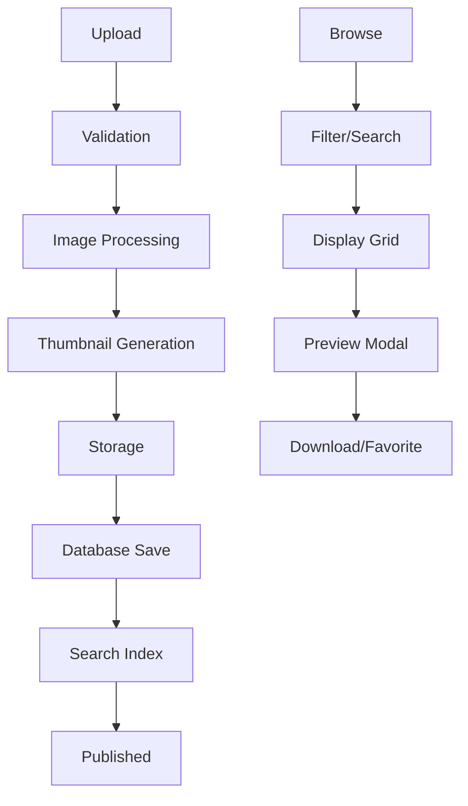

# 🖼️ Sistema de Wallpapers - Vision4K

## 🏗️ Arquitectura del Sistema

### 📊 Diagrama de Flujo



## 🖼️ Modelo de Wallpaper

### 📝 Estructura del Modelo

```php
<?php
// app/Models/Wallpaper.php

class Wallpaper extends Model
{
    use HasFactory, SoftDeletes;

    protected $fillable = [
        'title', 'description', 'file_path', 'thumbnail_path',
        'category_id', 'user_id', 'tags', 'file_size', 'resolution',
        'downloads_count', 'views_count', 'is_featured', 'is_active', 'is_premium'
    ];

    protected $casts = [
        'is_featured' => 'boolean',
        'is_active' => 'boolean',
        'is_premium' => 'boolean',
        'file_size' => 'integer',
        'downloads_count' => 'integer',
        'views_count' => 'integer',
    ];

    // Relaciones
    public function category(): BelongsTo
    {
        return $this->belongsTo(Category::class);
    }

    public function user(): BelongsTo
    {
        return $this->belongsTo(User::class);
    }

    public function downloads(): HasMany
    {
        return $this->hasMany(Download::class);
    }

    public function favorites(): BelongsToMany
    {
        return $this->belongsToMany(User::class, 'favorites')->withTimestamps();
    }
}
```

### 🔍 Scopes y Métodos

```php
// app/Models/Wallpaper.php

// Scopes para consultas comunes
public function scopeActive($query)
{
    return $query->where('is_active', true);
}

public function scopeFeatured($query)
{
    return $query->where('is_featured', true);
}

public function scopePremium($query)
{
    return $query->where('is_premium', true);
}

public function scopeFree($query)
{
    return $query->where('is_premium', false);
}

public function scopeTrending($query, $days = 7)
{
    return $query->where('created_at', '>=', now()->subDays($days))
                 ->orderByRaw('(downloads_count + views_count) DESC');
}

public function scopePopular($query)
{
    return $query->orderBy('downloads_count', 'desc');
}

public function scopeRecent($query)
{
    return $query->orderBy('created_at', 'desc');
}

// Métodos de utilidad
public function getTagsArray(): array
{
    return array_filter(array_map('trim', explode(',', $this->tags ?? '')));
}

public function setTagsArray(array $tags): void
{
    $this->tags = implode(',', array_filter($tags));
}

public function getFormattedFileSize(): string
{
    $bytes = $this->file_size;
    $units = ['B', 'KB', 'MB', 'GB'];

    for ($i = 0; $bytes > 1024 && $i < count($units) - 1; $i++) {
        $bytes /= 1024;
    }

    return round($bytes, 2) . ' ' . $units[$i];
}

public function getAspectRatio(): ?float
{
    if (!$this->resolution) return null;

    [$width, $height] = explode('x', $this->resolution);
    return round($width / $height, 2);
}

public function isFavoritedBy(User $user): bool
{
    return $this->favorites()->where('user_id', $user->id)->exists();
}

public function incrementViews(): void
{
    $this->increment('views_count');
}
```

## 📤 Sistema de Upload

### 🛡️ Validación de Archivos

```php
// app/Http/Requests/WallpaperUploadRequest.php

class WallpaperUploadRequest extends FormRequest
{
    public function authorize(): bool
    {
        return $this->user()->canUploadWallpapers();
    }

    public function rules(): array
    {
        return [
            'title' => 'required|string|max:255',
            'description' => 'nullable|string|max:1000',
            'category_id' => 'required|exists:categories,id',
            'tags' => 'nullable|string|max:500',
            'is_premium' => 'sometimes|boolean',
            'file' => [
                'required',
                'file',
                'mimes:jpeg,png,jpg,webp',
                'max:20480', // 20MB máximo
                new ImageDimensions(1920, 1080), // Mínimo 1920x1080
                new ImageAspectRatio([16/9, 4/3, 3/2, 1/1]), // Ratios permitidos
            ],
        ];
    }

    public function messages(): array
    {
        return [
            'file.max' => 'The image must not be larger than 20MB.',
            'file.mimes' => 'Only JPEG, PNG, and WebP images are allowed.',
        ];
    }
}

// app/Rules/ImageDimensions.php
class ImageDimensions implements Rule
{
    private int $minWidth;
    private int $minHeight;

    public function __construct(int $minWidth, int $minHeight)
    {
        $this->minWidth = $minWidth;
        $this->minHeight = $minHeight;
    }

    public function passes($attribute, $value): bool
    {
        if (!$value instanceof UploadedFile) return false;

        $dimensions = getimagesize($value->getPathname());
        if (!$dimensions) return false;

        [$width, $height] = $dimensions;

        return $width >= $this->minWidth && $height >= $this->minHeight;
    }

    public function message(): string
    {
        return "The image must be at least {$this->minWidth}x{$this->minHeight} pixels.";
    }
}
```

### 🔄 Procesamiento de Imágenes

```php
// app/Services/ImageProcessingService.php

class ImageProcessingService
{
    private string $wallpapersPath = 'wallpapers';
    private string $thumbnailsPath = 'thumbnails';

    public function processUpload(UploadedFile $file, array $data): array
    {
        // Generar nombres únicos
        $filename = $this->generateFilename($file);
        $thumbnailName = 'thumb_' . $filename;

        // Procesar imagen principal
        $mainPath = $this->processMainImage($file, $filename);

        // Generar thumbnail
        $thumbnailPath = $this->generateThumbnail($file, $thumbnailName);

        // Obtener metadatos
        $metadata = $this->getImageMetadata($file);

        return [
            'file_path' => $mainPath,
            'thumbnail_path' => $thumbnailPath,
            'file_size' => $file->getSize(),
            'resolution' => $metadata['width'] . 'x' . $metadata['height'],
            'metadata' => $metadata,
        ];
    }

    private function generateFilename(UploadedFile $file): string
    {
        return uniqid() . '_' . time() . '.' . $file->getClientOriginalExtension();
    }

    private function processMainImage(UploadedFile $file, string $filename): string
    {
        $image = Image::make($file);

        // Optimizar calidad
        $quality = config('vision4k.image_quality', 85);

        // Aplicar marca de agua si está configurada
        if (config('vision4k.watermark.enabled', false)) {
            $this->applyWatermark($image);
        }

        // Guardar imagen optimizada
        $path = storage_path("app/public/{$this->wallpapersPath}/{$filename}");
        $image->save($path, $quality);

        return "{$this->wallpapersPath}/{$filename}";
    }

    private function generateThumbnail(UploadedFile $file, string $thumbnailName): string
    {
        $image = Image::make($file);

        // Redimensionar manteniendo aspecto
        $image->resize(400, 300, function ($constraint) {
            $constraint->aspectRatio();
            $constraint->upsize();
        });

        // Centrar y recortar si es necesario
        $image->fit(400, 300);

        // Guardar thumbnail
        $path = storage_path("app/public/{$this->thumbnailsPath}/{$thumbnailName}");
        $image->save($path, 80);

        return "{$this->thumbnailsPath}/{$thumbnailName}";
    }

    private function applyWatermark($image): void
    {
        $watermark = Image::make(storage_path('app/watermark.png'));

        // Redimensionar marca de agua al 10% del ancho de la imagen
        $watermarkWidth = $image->width() * 0.1;
        $watermark->resize($watermarkWidth, null, function ($constraint) {
            $constraint->aspectRatio();
        });

        // Posicionar en esquina inferior derecha
        $image->insert($watermark, 'bottom-right', 20, 20);
    }

    private function getImageMetadata(UploadedFile $file): array
    {
        $image = Image::make($file);

        return [
            'width' => $image->width(),
            'height' => $image->height(),
            'mime_type' => $file->getMimeType(),
            'original_name' => $file->getClientOriginalName(),
            'aspect_ratio' => round($image->width() / $image->height(), 2),
        ];
    }
}
```

### 📤 Controlador de Upload

```php
// app/Http/Controllers/WallpaperUploadController.php

class WallpaperUploadController extends Controller
{
    private ImageProcessingService $imageService;

    public function __construct(ImageProcessingService $imageService)
    {
        $this->imageService = $imageService;
    }

    public function store(WallpaperUploadRequest $request)
    {
        try {
            DB::beginTransaction();

            // Procesar imagen
            $imageData = $this->imageService->processUpload(
                $request->file('file'),
                $request->validated()
            );

            // Crear wallpaper
            $wallpaper = Wallpaper::create([
                'title' => $request->title,
                'description' => $request->description,
                'category_id' => $request->category_id,
                'user_id' => $request->user()->id,
                'tags' => $request->tags,
                'is_premium' => $request->boolean('is_premium'),
                ...$imageData
            ]);

            // Indexar para búsqueda
            $wallpaper->searchable();

            DB::commit();

            return response()->json([
                'message' => 'Wallpaper uploaded successfully',
                'wallpaper' => $wallpaper->load(['category', 'user'])
            ], 201);

        } catch (\Exception $e) {
            DB::rollBack();

            // Limpiar archivos si algo salió mal
            $this->cleanupFailedUpload($imageData ?? []);

            return response()->json([
                'error' => 'Upload failed: ' . $e->getMessage()
            ], 500);
        }
    }

    private function cleanupFailedUpload(array $imageData): void
    {
        if (isset($imageData['file_path'])) {
            Storage::disk('public')->delete($imageData['file_path']);
        }

        if (isset($imageData['thumbnail_path'])) {
            Storage::disk('public')->delete($imageData['thumbnail_path']);
        }
    }
}
```

## 🔍 Sistema de Búsqueda

### 🔎 Búsqueda con Laravel Scout

```php
// app/Models/Wallpaper.php

use Laravel\Scout\Searchable;

class Wallpaper extends Model
{
    use Searchable;

    public function toSearchableArray(): array
    {
        return [
            'id' => $this->id,
            'title' => $this->title,
            'description' => $this->description,
            'tags' => $this->getTagsArray(),
            'category' => $this->category->name ?? '',
            'resolution' => $this->resolution,
            'is_premium' => $this->is_premium,
            'is_featured' => $this->is_featured,
            'downloads_count' => $this->downloads_count,
            'created_at' => $this->created_at->timestamp,
        ];
    }

    public function shouldBeSearchable(): bool
    {
        return $this->is_active;
    }
}
```

### 🎯 Controlador de Búsqueda

```php
// app/Http/Controllers/SearchController.php

class SearchController extends Controller
{
    public function search(Request $request)
    {
        $request->validate([
            'q' => 'required|string|min:2|max:100',
            'category' => 'nullable|exists:categories,id',
            'resolution' => 'nullable|string',
            'premium' => 'nullable|boolean',
            'sort' => 'nullable|in:relevance,newest,popular,downloads',
            'per_page' => 'nullable|integer|min:12|max:48',
        ]);

        $query = $request->q;
        $builder = Wallpaper::search($query);

        // Filtros
        if ($request->category) {
            $builder->where('category_id', $request->category);
        }

        if ($request->has('premium')) {
            $builder->where('is_premium', $request->boolean('premium'));
        }

        if ($request->resolution) {
            $builder->where('resolution', $request->resolution);
        }

        // Ordenamiento
        switch ($request->sort) {
            case 'newest':
                $builder->orderBy('created_at', 'desc');
                break;
            case 'popular':
                $builder->orderBy('downloads_count', 'desc');
                break;
            case 'downloads':
                $builder->orderBy('downloads_count', 'desc');
                break;
            default:
                // Relevancia por defecto
                break;
        }

        $wallpapers = $builder
            ->where('is_active', true)
            ->paginate($request->get('per_page', 24));

        // Registrar búsqueda para analytics
        SearchLog::create([
            'query' => $query,
            'results_count' => $wallpapers->total(),
            'user_id' => $request->user()?->id,
            'ip_address' => $request->ip(),
        ]);

        return response()->json([
            'wallpapers' => $wallpapers,
            'query' => $query,
            'filters' => $request->only(['category', 'resolution', 'premium', 'sort'])
        ]);
    }

    public function suggestions(Request $request)
    {
        $query = $request->get('q', '');

        if (strlen($query) < 2) {
            return response()->json(['suggestions' => []]);
        }

        // Sugerencias basadas en títulos y tags
        $suggestions = Wallpaper::active()
            ->where(function ($q) use ($query) {
                $q->where('title', 'LIKE', "%{$query}%")
                  ->orWhere('tags', 'LIKE', "%{$query}%");
            })
            ->limit(10)
            ->pluck('title')
            ->unique()
            ->values();

        return response()->json(['suggestions' => $suggestions]);
    }
}
```

## 📥 Sistema de Descarga

### 🔒 Controlador de Descarga Seguro

```php
// app/Http/Controllers/DownloadController.php

class DownloadController extends Controller
{
    private DownloadService $downloadService;

    public function __construct(DownloadService $downloadService)
    {
        $this->downloadService = $downloadService;
    }

    public function download(Request $request, Wallpaper $wallpaper)
    {
        try {
            // Verificar que el wallpaper esté activo
            if (!$wallpaper->is_active) {
                return response()->json(['error' => 'Wallpaper not available'], 404);
            }

            $user = $request->user();

            // Para usuarios no autenticados, verificar límites por IP
            if (!$user) {
                $this->checkAnonymousDownloadLimits($request);
            } else {
                // Verificar límites de usuario
                if (!$user->canDownload()) {
                    return response()->json([
                        'error' => 'Download limit exceeded',
                        'remaining' => $user->getRemainingDownloads(),
                        'upgrade_url' => route('premium.plans')
                    ], 403);
                }

                // Verificar contenido premium
                if ($wallpaper->is_premium && !$user->isPremiumActive()) {
                    return response()->json([
                        'error' => 'Premium content requires subscription',
                        'upgrade_url' => route('premium.plans')
                    ], 403);
                }
            }

            // Registrar descarga
            $download = $this->downloadService->recordDownload($user, $wallpaper, $request);

            // Incrementar contador de vistas
            $wallpaper->incrementViews();

            // Generar URL de descarga temporal
            $downloadUrl = $this->generateSecureDownloadUrl($wallpaper, $download);

            return response()->json([
                'download_url' => $downloadUrl,
                'filename' => $this->getDownloadFilename($wallpaper),
                'file_size' => $wallpaper->getFormattedFileSize(),
                'resolution' => $wallpaper->resolution,
            ]);

        } catch (\Exception $e) {
            return response()->json([
                'error' => $e->getMessage()
            ], 400);
        }
    }

    public function serveFile(Request $request, string $token)
    {
        // Verificar token de descarga
        $downloadToken = DownloadToken::where('token', $token)
            ->where('expires_at', '>', now())
            ->first();

        if (!$downloadToken) {
            abort(404, 'Download link expired or invalid');
        }

        $wallpaper = $downloadToken->wallpaper;
        $filePath = storage_path('app/public/' . $wallpaper->file_path);

        if (!file_exists($filePath)) {
            abort(404, 'File not found');
        }

        // Marcar token como usado
        $downloadToken->update(['used_at' => now()]);

        // Servir archivo con headers apropiados
        return response()->download($filePath, $this->getDownloadFilename($wallpaper), [
            'Content-Type' => mime_content_type($filePath),
            'Content-Length' => filesize($filePath),
            'Cache-Control' => 'no-cache, must-revalidate',
        ]);
    }

    private function checkAnonymousDownloadLimits(Request $request): void
    {
        $ip = $request->ip();
        $dailyLimit = config('vision4k.anonymous_download_limit', 5);

        $todayDownloads = Download::where('ip_address', $ip)
            ->whereNull('user_id')
            ->whereDate('created_at', now())
            ->count();

        if ($todayDownloads >= $dailyLimit) {
            throw new \Exception('Daily download limit reached. Please register for more downloads.');
        }
    }

    private function generateSecureDownloadUrl(Wallpaper $wallpaper, Download $download): string
    {
        $token = Str::random(64);

        DownloadToken::create([
            'token' => $token,
            'wallpaper_id' => $wallpaper->id,
            'download_id' => $download->id,
            'expires_at' => now()->addMinutes(15), // Token válido por 15 minutos
        ]);

        return route('download.serve', ['token' => $token]);
    }

    private function getDownloadFilename(Wallpaper $wallpaper): string
    {
        $title = Str::slug($wallpaper->title);
        $resolution = $wallpaper->resolution;
        $extension = pathinfo($wallpaper->file_path, PATHINFO_EXTENSION);

        return "{$title}_{$resolution}.{$extension}";
    }
}
```

## 📊 Sistema de Moderación

### 🛡️ Políticas de Acceso

```php
// app/Policies/WallpaperPolicy.php

class WallpaperPolicy
{
    public function viewAny(?User $user): bool
    {
        return true; // Todos pueden ver wallpapers públicos
    }

    public function view(?User $user, Wallpaper $wallpaper): bool
    {
        if (!$wallpaper->is_active) {
            return $user && ($user->isModerator() || $wallpaper->user_id === $user->id);
        }

        return true;
    }

    public function create(User $user): bool
    {
        return $user->canUploadWallpapers();
    }

    public function update(User $user, Wallpaper $wallpaper): bool
    {
        return $user->id === $wallpaper->user_id || $user->isModerator();
    }

    public function delete(User $user, Wallpaper $wallpaper): bool
    {
        return $user->canDeleteWallpaper($wallpaper);
    }

    public function feature(User $user): bool
    {
        return $user->isModerator();
    }

    public function moderate(User $user): bool
    {
        return $user->isModerator();
    }
}
```

### 🔍 Sistema de Reportes

```php
// app/Http/Controllers/ModerationController.php

class ModerationController extends Controller
{
    public function reportWallpaper(Request $request, Wallpaper $wallpaper)
    {
        $request->validate([
            'reason' => 'required|in:inappropriate,copyright,spam,quality,other',
            'description' => 'nullable|string|max:500',
        ]);

        $report = WallpaperReport::create([
            'wallpaper_id' => $wallpaper->id,
            'user_id' => $request->user()?->id,
            'ip_address' => $request->ip(),
            'reason' => $request->reason,
            'description' => $request->description,
        ]);

        // Notificar a moderadores si hay muchos reportes
        $totalReports = $wallpaper->reports()->count();
        if ($totalReports >= config('vision4k.auto_moderate_threshold', 5)) {
            $this->autoModerate($wallpaper);
        }

        return response()->json([
            'message' => 'Report submitted successfully'
        ]);
    }

    private function autoModerate(Wallpaper $wallpaper): void
    {
        $wallpaper->update(['is_active' => false]);

        // Notificar moderadores
        $moderators = User::where('role', 'moderator')
            ->orWhere('role', 'admin')
            ->get();

        foreach ($moderators as $moderator) {
            $moderator->notify(new WallpaperAutoModerated($wallpaper));
        }
    }
}
```

## 📈 Analytics y Métricas

### 📊 Tracking de Eventos

```php
// app/Services/WallpaperAnalyticsService.php

class WallpaperAnalyticsService
{
    public function trackView(Wallpaper $wallpaper, Request $request): void
    {
        WallpaperView::create([
            'wallpaper_id' => $wallpaper->id,
            'user_id' => $request->user()?->id,
            'ip_address' => $request->ip(),
            'user_agent' => $request->userAgent(),
            'referer' => $request->header('referer'),
        ]);

        // Incrementar contador cache
        Cache::increment("wallpaper_views:{$wallpaper->id}");
    }

    public function getPopularTags(int $limit = 20): array
    {
        return DB::table('wallpapers')
            ->where('is_active', true)
            ->whereNotNull('tags')
            ->pluck('tags')
            ->flatMap(function ($tags) {
                return array_map('trim', explode(',', $tags));
            })
            ->filter()
            ->countBy()
            ->sortDesc()
            ->take($limit)
            ->toArray();
    }

    public function getTrendingWallpapers(int $days = 7, int $limit = 20): Collection
    {
        return Wallpaper::active()
            ->where('created_at', '>=', now()->subDays($days))
            ->orderByRaw('(downloads_count + views_count) DESC')
            ->limit($limit)
            ->get();
    }
}
```

---

El sistema de wallpapers de Vision4K está diseñado para manejar grandes volúmenes de contenido con alta performance, búsqueda avanzada y moderación automática. 🚀
